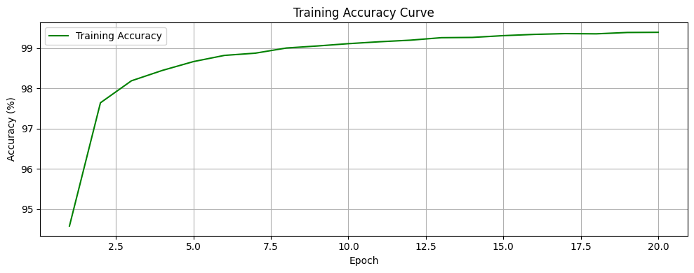
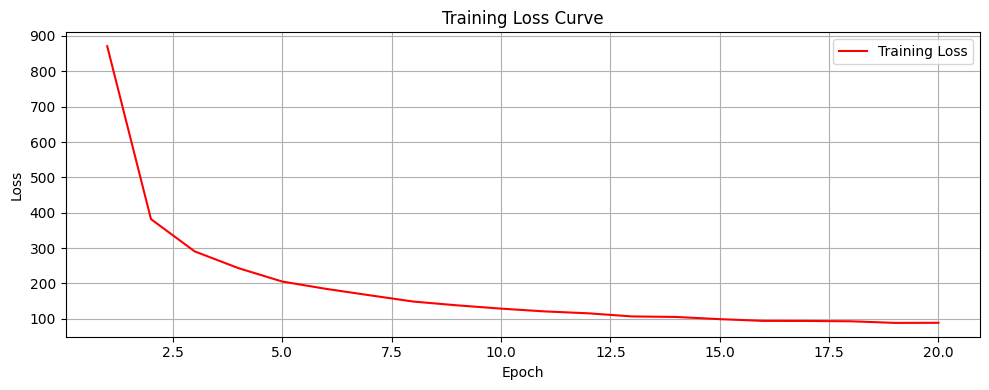
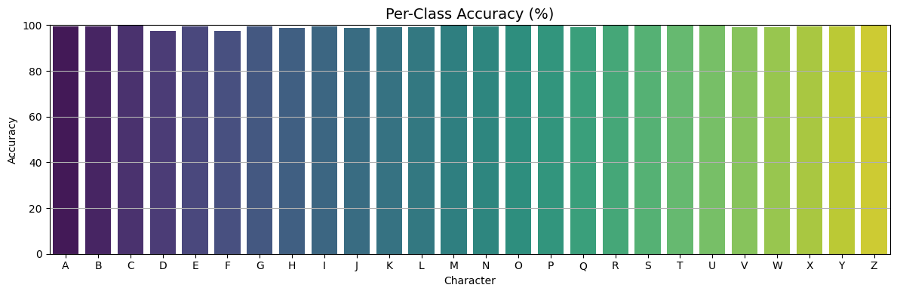
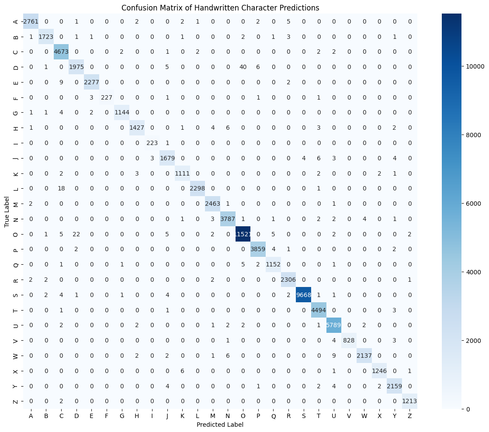

# 🧠 Handwritten Character Recognition using CNN (PyTorch)

This project demonstrates a Convolutional Neural Network (CNN) built with PyTorch to recognize handwritten alphanumeric characters from images. It can identify uppercase letters (A–Z), lowercase letters (a–z), and digits (0–9).

---

## 📌 Features

- CNN model built with `torch.nn`
- Trained using custom image dataset
- CUDA-enabled for GPU acceleration
- Training progress tracked with `tqdm`
- Accuracy calculation & manual predictions supported
- Image visualization of model predictions

---

## 🗂 Dataset

This repository includes the dataset used to train the character recognition model.

### Folder Structure
dataset/
├── A/
├── B/
├── ...
├── Z/

Each folder contains grayscale images of individual characters.

> 📌 Make sure the notebook uses the correct dataset path (e.g., `dataset/`).
> 🧩 Total dataset size: 682 MB

---

## 📁 Project Structure

Character_Recognition/
├── data/
  └── A-Z_Data.csv
├── models/
  └── character_cnn_model.pt
├── notebook/
  └── Character_recognition_notebook.ipynb
├── requirements.txt
├── .gitignore
└── README.md


---

## 🚀 Getting Started

1. **Clone the repository**
   ```bash
   git clone https://github.com/your-username/Character_Recognition.git
   cd Character_Recognition

2. Install dependencies

pip install -r requirements.txt

3. Launch the notebook

jupyter notebook Notebook/Character_recognition_notebook.ipynb


## 🧪 Model Details

Architecture: 2+ convolutional layers with ReLU and MaxPooling

Loss Function: CrossEntropyLoss

Optimizer: Adam

Metrics: Accuracy, Loss per epoch

Input Shape: Adjusted via transforms.Resize and transforms.ToTensor


---

## 🚀 Sample Results

### 🎯 Training & Validation Curves
  


### 📊 Per-Class Accuracy & Confusion Matrix
  


---

## ✅ Summary

- Strong fundamentals with clean design and visuals.
- Add polished README visuals, license, usage instructions, and version pinning to level it up further.

Would you like me to generate or update any of these—for example, embed visuals in README, add a license, draft a `predict.py`, or pin your `requirements.txt`?
::contentReference[oaicite:0]{index=0}

---


Let me know if you'd like to:
- Add screenshots or sample predictions
- Customize any specific section (like author name, contact, etc.)

Once you're done with this, we can go ahead with the git initialization and pushing the notebook and files to GitHub.
